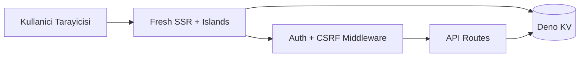
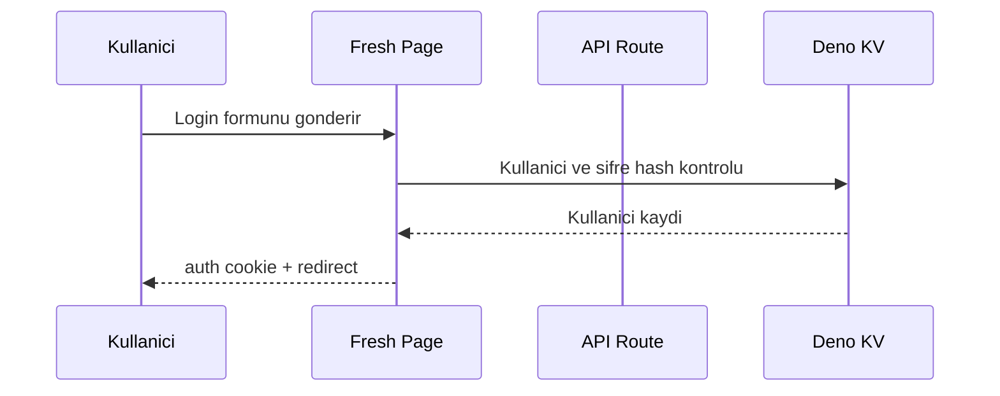
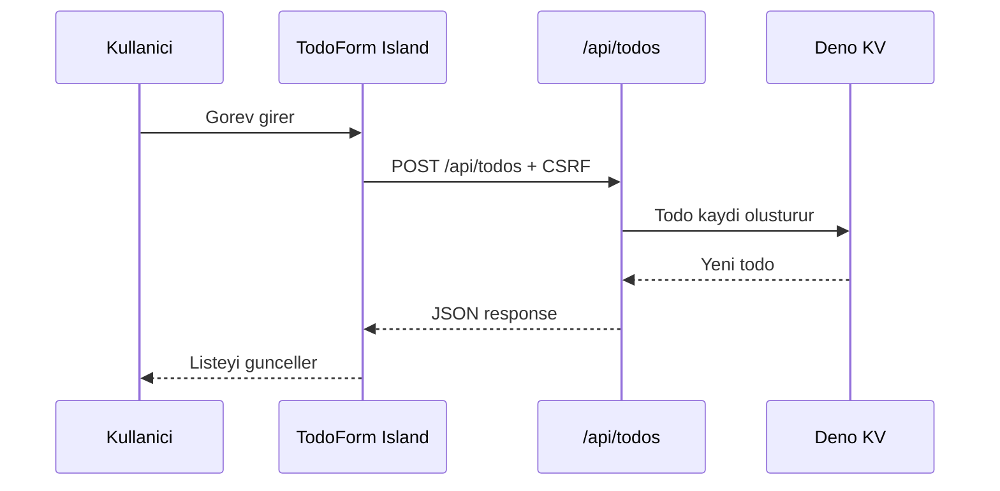
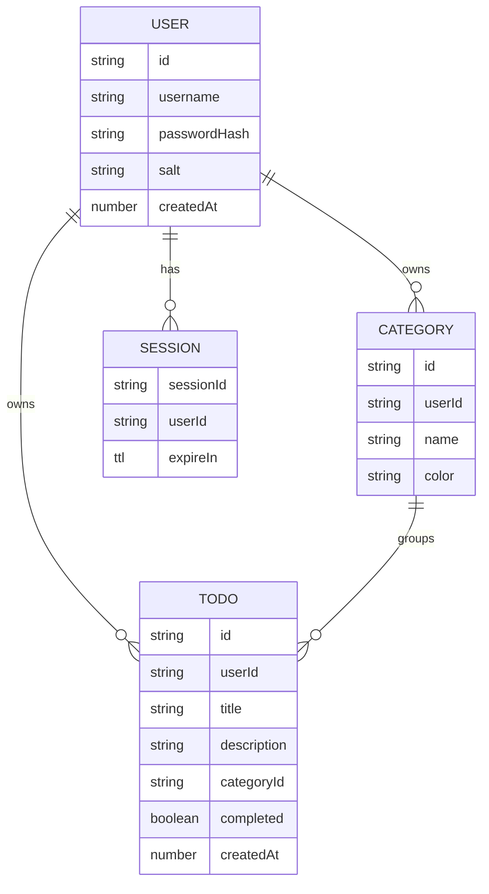

# Deno Fresh Todo Uygulamasi - Proje Raporu

> **Proje Kodu:** P26\
> **Zorluk:** Orta-Zor\
> **Ders:** BMU1208 Web Tabanli Programlama\
> **Ogrenci:** MERLIN DELOR AKENMOE KAMCHE\
> **Ogrenci No:** 24080410153\
> **Canli Demo:** <https://final-projesi.delor237.deno.net>\
> **GitHub:** <https://github.com/delor237/Final-projesi>

## 1. Proje Kunyesi

| Alan           | Deger                         |
| -------------- | ----------------------------- |
| Proje Adi      | Deno Fresh Todo Uygulamasi    |
| Kategori       | Productivity / Gorev Yonetimi |
| Hedef Platform | Responsive Web                |
| Runtime        | Deno                          |
| Framework      | Fresh                         |
| UI             | Preact Islands                |
| Stil           | Twind                         |
| Veritabani     | Deno KV                       |
| Deployment     | Deno Deploy                   |
| Lisans         | MIT                           |
| Durum          | Launched + Maintenance        |

## 2. Executive Summary

Bu proje, bireysel kullanicilarin gunluk islerini organize edebilmesi icin
gelistirilmis, Deno Fresh tabanli bir todo uygulamasidir. Uygulama, kullanici
hesabi, oturum yonetimi, kategori bazli filtreleme, gorev ekleme, tamamlama ve
silme islemlerini destekler.

Fresh framework'un SSR ve islands mimarisi sayesinde sayfalar sunucuda hizli
render edilir, sadece gerekli etkilesimli parcalar istemci tarafinda hydrate
edilir. Deno KV ile harici bir veritabani kurulumu olmadan kalici veri saklama
saglanir.

Basari olcutu, uygulamanin canli demo ortaminda sorunsuz calismasi, temel CRUD
akislari tamamlamasi, kimlik dogrulama ve veri sahipligi kontrollerini yapmasi,
ve `deno task check` / `deno task build` komutlarindan gecmesidir.

## 3. Problem ve Motivasyon

Ogrenciler ve bireysel kullanicilar gunluk islerini genellikle daginik notlar,
mesajlar veya hatirlatmalar uzerinden takip eder. Bu durum islerin onceligini,
kategorisini ve tamamlanma durumunu gormeyi zorlastirir.

Bu proje, sade ve hizli bir web arayuzuyle kullanicinin kendi gorevlerini tek
yerden yonetmesini hedefler. Deno Fresh secimi, modern web gelistirme
yaklasimlarini ogrenmek ve server-side rendering, islands mimarisi, Deno KV gibi
konulari pratikte uygulamak icin yapilmistir.

## 4. Hedef Kitle ve Persona

### Birincil Segment

Universite ogrencileri, yazilim ogrencileri ve kisisel gorevlerini kategorilere
ayirarak takip etmek isteyen bireysel kullanicilar.

### Persona 1 - Ogrenci

| Alan                       | Deger                                                  |
| -------------------------- | ------------------------------------------------------ |
| Rol                        | Bilgisayar muhendisligi ogrencisi                      |
| Hedef                      | Ders, proje ve kisisel isleri tek ekrandan takip etmek |
| Pain point                 | Gorevleri farkli uygulamalarda daginik tutmak          |
| En cok kullanacagi ozellik | Kategori filtreleme ve tamamlandi isaretleme           |

### Persona 2 - Junior Developer

| Alan                       | Deger                                                  |
| -------------------------- | ------------------------------------------------------ |
| Rol                        | Stajyer / junior yazilim gelistirici                   |
| Hedef                      | Gunluk is listesi ve ufak teknik notlari takip etmek   |
| Pain point                 | Basit isler icin agir proje yonetim araclari kullanmak |
| En cok kullanacagi ozellik | Hizli gorev ekleme, aciklama ve kategori               |

## 5. Urun Gereksinimleri

### In Scope

1. Kullanici kaydi ve girisi.
2. Oturum cookie'si ile kullanici durumunu koruma.
3. Gorev ekleme, listeleme, tamamlama ve silme.
4. Kategori ekleme, guncelleme, silme.
5. Gorevleri kategoriye baglama.
6. Kategoriye gore filtreleme.
7. Light/dark tema destegi.
8. Deno KV ile kalici veri saklama.
9. CSRF ve sahiplik kontrolleri.

### Out of Scope

- Takim/collaboration ozellikleri.
- E-posta dogrulama.
- Dosya yukleme.
- Mobil uygulama.
- Odeme sistemi.

### User Stories

| ID    | User Story                                             | Oncelik | Durum |
| ----- | ------------------------------------------------------ | ------- | ----- |
| FR-01 | Kullanici hesap olusturabilmeli.                       | Must    | Var   |
| FR-02 | Kullanici giris yapabilmeli.                           | Must    | Var   |
| FR-03 | Kullanici cikis yapabilmeli.                           | Must    | Var   |
| FR-04 | Kullanici gorev ekleyebilmeli.                         | Must    | Var   |
| FR-05 | Kullanici gorevleri listeleyebilmeli.                  | Must    | Var   |
| FR-06 | Kullanici gorevi tamamlandi olarak isaretleyebilmeli.  | Must    | Var   |
| FR-07 | Kullanici gorev silebilmeli.                           | Must    | Var   |
| FR-08 | Kullanici kategori olusturabilmeli.                    | Should  | Var   |
| FR-09 | Kullanici kategori guncelleyebilmeli.                  | Should  | Var   |
| FR-10 | Kullanici kategori silebilmeli.                        | Should  | Var   |
| FR-11 | Kullanici gorevleri kategoriye gore filtreleyebilmeli. | Should  | Var   |
| FR-12 | Kullanici tema degistirebilmeli.                       | Could   | Var   |

## 6. Teknoloji Yigini

| Katman     | Teknoloji               | Rol                                             |
| ---------- | ----------------------- | ----------------------------------------------- |
| Runtime    | Deno                    | TypeScript calistirma, izin modeli, task runner |
| Framework  | Fresh 1.7.3             | SSR, routing, islands mimarisi                  |
| UI         | Preact 10.22            | Component tabanli arayuz                        |
| State      | Preact Signals          | Island'lar arasi basit state paylasimi          |
| Stil       | Twind + Tailwind preset | Utility-first CSS                               |
| Veritabani | Deno KV                 | User, session, todo ve kategori saklama         |
| Deployment | Deno Deploy             | Edge uyumlu yayinlama                           |

### Neden Deno Fresh?

Fresh, server-side rendering'i varsayilan olarak kullanir ve istemciye sadece
etkilesimli island kodlarini gonderir. Bu proje icin klasik SPA yaklasimindan
daha sade, hizli ve Deno ekosistemiyle uyumlu bir yapi sunar.

### Neden Deno KV?

Deno KV, kurulum gerektirmeyen key-value veritabani saglar. Kucuk ve orta
olcekli bir todo uygulamasinda kullanici, oturum, gorev ve kategori verileri
icin yeterlidir.

## 7. Sistem Mimarisi



### Temel Akislar





## 8. Veri Modeli



### KV Anahtar Yapisi

| Veri           | Key                                  |
| -------------- | ------------------------------------ |
| User           | `["users", userId]`                  |
| Username index | `["users_by_username", username]`    |
| Session        | `["sessions", sessionId]`            |
| Todo by id     | `["todos", todoId]`                  |
| Todo by user   | `["todos_by_user", userId, todoId]`  |
| Category       | `["categories", userId, categoryId]` |

## 9. API Tasarimi

| Method | Endpoint          | Aciklama                             | Auth            |
| ------ | ----------------- | ------------------------------------ | --------------- |
| POST   | `/login`          | Login veya register form islemi      | Public + CSRF   |
| GET    | `/logout`         | Oturum sonlandirma                   | Optional        |
| GET    | `/api/todos`      | Kullanici gorevlerini JSON dondurur  | Required        |
| POST   | `/api/todos`      | Yeni gorev olusturur                 | Required + CSRF |
| PATCH  | `/api/todos`      | Gorev tamamlanma durumunu degistirir | Required + CSRF |
| DELETE | `/api/todos`      | Gorev siler                          | Required + CSRF |
| GET    | `/api/categories` | Kategorileri JSON dondurur           | Required        |
| POST   | `/api/categories` | Kategori olusturur                   | Required + CSRF |
| PATCH  | `/api/categories` | Kategori gunceller                   | Required + CSRF |
| DELETE | `/api/categories` | Kategori siler                       | Required + CSRF |

Ayrintili OpenAPI tanimi `openapi.yaml` dosyasinda tutulur.

## 10. UI/UX Tasarimi

### Sitemap

```text
/
|-- /login
|-- /categories
|-- /logout
|-- /api/todos
`-- /api/categories
```

### Tasarim Ozellikleri

- Responsive layout.
- Desktop ve mobil navbar.
- Light/dark tema.
- Kategori filtre bar'i.
- Todo formu ve todo listesi.
- Bos liste durumu.
- 404 ve 500 hata sayfalari.

### Ekran Goruntuleri

Mevcut ekran goruntuleri:

- `screenshots/demo.png`
- `screenshots/dark-mode.png`
- `screenshots/categories.png`
- `screenshots/login.png`

Eksik ekran goruntuleri:

- Mobil gorunum.
- Bos todo listesi.
- 404 hata sayfasi.
- Kategori duzenleme durumu.

Bu liste ayrica `docs/screenshots-checklist.md` dosyasinda takip edilir.

## 11. Guvenlik, Performans ve Test

### Uygulanan Guvenlik Kontrolleri

- `httpOnly` auth cookie.
- `sameSite=Lax` cookie.
- HTTPS ortaminda `secure` cookie.
- CSRF token kontrolu.
- API route'larda auth zorunlulugu.
- Todo ve kategori islemlerinde user ownership kontrolu.
- Deno KV atomic islemleri.
- Temel security header'lari.
- Login/register icin basit rate limiting.

### Bilinen Sinirlar

- Sifre hashing salted SHA-256 ile yapilir; uretim icin Argon2/bcrypt daha
  gucludur.
- E-posta dogrulama yoktur.
- Hesap silme / veri export ozelligi yoktur.
- Rate limit memory tabanlidir; multi-region ortamda merkezi store gerekebilir.

### Performans

Fresh SSR ve islands mimarisi nedeniyle ilk sayfa yuklemesi hafiftir. Static
asset'ler Fresh build ile uretilir. Deno Deploy edge ortami uygulama icin uygun
bir yayinlama hedefidir.

### Test

Projede Deno test runner ile temel auth, todo ve kategori davranislari test
edilir. CI pipeline'i format, lint, type-check, test ve build adimlarini
calistirir.

## 12. Maliyet ve Deployment

| Kalem      | Saglayici          | Tahmini Maliyet  |
| ---------- | ------------------ | ---------------- |
| Hosting    | Deno Deploy        | Free tier        |
| Veritabani | Deno KV            | Free/usage based |
| Domain     | Opsiyonel          | Degisken         |
| Monitoring | Manuel / Deno logs | Free             |

Canli ortam Deno Deploy uzerinden yayinlanir:

<https://final-projesi.delor237.deno.net>

## 13. Post-Launch Review

### Iyi Yapilanlar

1. Fresh islands mimarisi kullanildi.
2. Deno KV ile kalici veri saklama saglandi.
3. Auth, CSRF ve sahiplik kontrolleri eklendi.
4. Light/dark tema ve responsive UI hazirlandi.

### Gelistirilecekler

1. Sifre hash algoritmasi Argon2/bcrypt seviyesine cikarilmali.
2. Daha kapsamli E2E testler eklenmeli.
3. Mobil ve hata ekran goruntuleri tamamlanmali.
4. Privacy policy ve hesap silme akisi eklenmeli.

### Kullanilan Yapay Zeka Araclari

| Arac            | Kullanim                                             |
| --------------- | ---------------------------------------------------- |
| ChatGPT / Codex | Kod analizi, dokumantasyon, test ve planlama destegi |

## Ekler

- `README.md`
- `docs/api-endpoints.md`
- `docs/kv-database-schema.md`
- `docs/adr/`
- `docs/architecture.md`
- `docs/screenshots-checklist.md`
- `openapi.yaml`
- `screenshots/`
- `.github/workflows/ci.yml`
