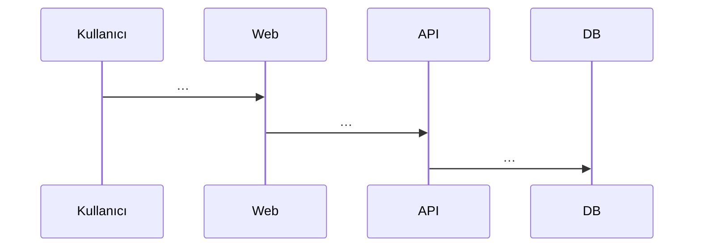
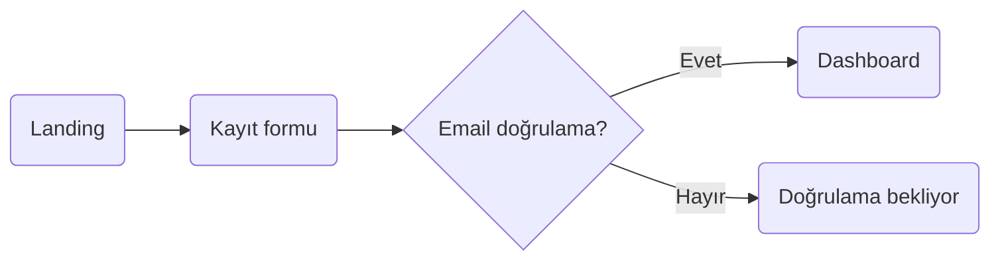

<!--
========================================================================
 PROJE RAPORU ŞABLONU — BMU1208 Web Tabanlı Programlama
 Bitlis Eren Üniversitesi — Dr. Öğr. Üyesi Davut ARI
========================================================================

 Bu dosya final proje raporunuzun ana iskeletidir. Toplam 12 bölüm var.
 HER BÖLÜMÜ doldurun. Boş bırakılan bölümler puan kaybı getirir.

 Placeholder kuralları:
   {{...}}        → Doldurulacak değişken alan
   [...]          → Sizin yazacağınız açıklama
   TODO:          → Yapılacak iş, silin
   (Rehber: XX)   → İlgili rehber dosyasına gidin (00-REHBER/)

 Yazım stili:
   - Cümleler kısa ve somut olsun.
   - "Hızlı" ≠ "P95 < 300ms"; sayı kullanın.
   - Her iddianın bir kaynağı olsun (link, kullanıcı alıntısı, veri).
   - Markdown formatı kullanın; kod blokları ```tr```.

 Başarılar!
========================================================================
-->

# Deno Fresh Framework

> **Proje Kodu:** P26 · **Zorluk:** Orta-Zor · **Puan:** 50 · **Hafta:** 2

**Öğrenci:** MERLIN DELOR AKENMOE KAMCHE\
**Öğrenci No:** 24080410153\
**E-posta:** delorakenmoe@gmail.com\
**Ders:** BMU1208 Web Tabanlı Programlama — _Dr. Öğr. Üyesi Davut ARI_\
**Kurum:** Bitlis Eren Üniversitesi — Mühendislik-Mimarlık Fakültesi —
Bilgisayar Mühendisliği\
**Dönem:** 2025-2026 Bahar\
**Son Güncelleme:** 16.04.2026

---

## İçindekiler

1. [Proje Künyesi](#1-proje-künyesi)
2. [Executive Summary](#2-executive-summary)
3. [Problem ve Motivasyon](#3-problem-ve-motivasyon)
4. [Hedef Kitle ve Persona](#4-hedef-kitle-ve-persona)
5. [Ürün Gereksinimleri (PRD)](#5-ürün-gereksinimleri-prd)
6. [Piyasa ve Rekabet Analizi](#6-piyasa-ve-rekabet-analizi)
7. [Teknoloji Yığını (Tech Stack)](#7-teknoloji-yığını-tech-stack)
8. [Sistem Mimarisi](#8-sistem-mimarisi)
9. [Veri Modeli ve API Tasarımı](#9-veri-modeli-ve-api-tasarımı)
10. [UI/UX Tasarımı](#10-uiux-tasarımı)
11. [Güvenlik, Performans, Test](#11-güvenlik-performans-test)
12. [Maliyet, Gelir Modeli, GTM](#12-maliyet-gelir-modeli-gtm)
13. [Ek: Post-Launch Review](#13-ek-post-launch-review)

---

## 1. Proje Künyesi

| Alan             | Değer                                                           |
| ---------------- | --------------------------------------------------------------- |
| Proje Adı        | Deno Fresh Framework                                            |
| Proje Kodu       | P26                                                             |
| Slogan (1 cümle) | [_örn. "Bir HTML dosyası kadar hafif, bir mağaza kadar güçlü"_] |
| Kategori         | [_örn. E-ticaret / Productivity / Finance / Education / …_]     |
| Hedef Platform   | Web (responsive) · [Mobile web · PWA · Desktop (Tauri)]         |
| GitHub           | https://github.com/delor237/Final-projesi                       |
| Canlı Demo       | https://final-projesi.delor237.deno.net                         |
| Demo Videosu     | [Video Demo İzle](./docs/demo.mp4)                              |
| Demo Kullanıcı   | Email: `demo@example.com` · Şifre: `demo123`                    |
| Lisans           | MIT                                                             |
| Başlangıç        | 2026-04-15                                                      |
| Hedef Bitiş      | 2026-06-15                                                      |
| Durum            | 🟡 Development / 🟢 Launched / 🔵 Maintenance                   |

### Varsayılan Tech Stack (özet)

| Katman     | Teknolojiler                                        |
| ---------- | --------------------------------------------------- |
| Framework  | Astro 5                                             |
| Content    | MDX + Astro Content Collections                     |
| Styling    | Tailwind CSS 4, Astro-UI (opsiyonel)                |
| Etkileşim  | Alpine.js / React islands (sadece gerekli kısımlar) |
| Search     | Pagefind (static site search)                       |
| Deployment | Netlify / Cloudflare Pages                          |

> Detaylar için Bölüm 7.

---

## 2. Executive Summary

_3 paragraf, toplam ~200-300 kelime. Bir yatırımcı / işe alım mülakatında 2
dakikada anlatacak özet._

### 2.1 Ne Yapıyoruz?

[_Ürünün adı + kime hizmet ettiği + ana değeri. 2-3 cümle._]

> Örnek: _"FlashCart, küçük Türk markaları için tamamen ücretsiz, Alpine.js
> tabanlı minimal e-ticaret çözümüdür. Shopify'ın $29/ay başlangıç ücretini
> ödemek yerine, kullanıcı bir statik hosting'e deploy edip aynı gün satışa
> başlar."_

### 2.2 Neden Şimdi?

[_Trend, piyasa koşulu, teknolojik kırılım. Kanıt: istatistik, haber, trend
grafiği._]

### 2.3 Başarı Nasıl Görünüyor?

[_Hedef (1 yıl, 3 yıl). Ölçülebilir: aktif kullanıcı, gelir, NPS._]

> Örnek: _"1. yıl hedef: 500 aktif satıcı, ₺200K MRR, NPS ≥ 40. 3. yıl: 5000
> satıcı, ₺2M MRR, yıllık %30 büyüme."_

---

## 3. Problem ve Motivasyon

_(Rehber: 04-PRD-VE-URUN-YONETIMI.md)_

### 3.1 Hangi Probleme Çözüm Getiriyoruz?

[_Problem ifadesi 1-2 paragraf. Teknik değil, insani bir dille._]

### 3.2 Kanıt: Problem Gerçekten Var Mı?

Sayısal veya alıntı kanıt:

- **İstatistik:** [_örn. "Türkiye'de 2024'te 1.2 milyon aktif e-ticaret sitesi;
  bunların %65'i aylık 10'dan az sipariş alıyor (E-Ticaret İstatistik Raporu,
  TOBB)."_]
- **Kullanıcı alıntısı:** [_"Ekşi Sözlük'te bir kullanıcı: 'Shopify'a 2 ay
  ödedim, 3 sipariş aldım, kapattım.' — kaynak linki_]
- **Google Trends:** [_"'ücretsiz e-ticaret kurulumu' araması 2023'ten 2026'ya
  4× arttı._]
- **Reddit / Forum konuları:** [_3-5 gerçek konu linki_]

### 3.3 Mevcut Çözümler ve Eksikleri

| Mevcut çözüm     | Kullanıcıya ne vadeder? | Neden yetersiz?                                      |
| ---------------- | ----------------------- | ---------------------------------------------------- |
| [_Örn. Shopify_] | Sürükle-bırak mağaza    | Aylık $29+ minimum, Türkiye'den bazı feature'lar yok |
| [_…_]            |                         |                                                      |
| [_…_]            |                         |                                                      |

### 3.4 Bizim Diferansiyasyonumuz

1. [_Farkımız 1_]
2. [_Farkımız 2_]
3. [_Farkımız 3_]

### 3.5 Kapsam Dışı Bıraktığımız Problemler (Non-Problems)

V1'de çözmeyeceğimiz ama potansiyel olarak çözülebilecek problemler:

- [_Problem 1 — neden şimdi değil_]
- [_Problem 2_]

---

## 4. Hedef Kitle ve Persona

_(Rehber: 04-PRD-VE-URUN-YONETIMI.md — Persona + JTBD bölümleri)_

### 4.1 Birincil Segment

[_Bir cümle ile tanımla: "28-45 yaş arası, küçük butik markası kuran
girişimciler, İstanbul/Ankara/İzmir ağırlıklı"._]

### 4.2 İkincil Segment

[_Opsiyonel ikinci segment_]

### 4.3 Persona Kartları (2 adet)

#### 👩‍💼 Persona 1 — "[İsim]"

| Alan                     | Değer                           |
| ------------------------ | ------------------------------- |
| Yaş / Şehir              | [_…_]                           |
| Rol / Meslek             | [_…_]                           |
| Teknoloji kullanımı      | [_iOS/Android, bilgi seviyesi_] |
| Günlük rutini            | [_1-2 cümle_]                   |
| Ana hedefi               | [_…_]                           |
| Pain points              | [_3 madde_]                     |
| Ürünümüzü ne zaman açar? | [_somut durum_]                 |
| Motto                    | _"…"_                           |

#### 👨‍🎓 Persona 2 — "[İsim]"

_(Aynı format)_

### 4.4 Jobs To Be Done (JTBD)

En az 3 JTBD cümlesi:

1. _"When I'm **[durum]**, I want to **[amaç]**, so I can **[sonuç]**."_
2. _"When I'm …"_
3. _"When I'm …"_

### 4.5 Persona'lar Hangi Feature'ları Öncelikli Kullanır?

| Özellik       | Persona 1 | Persona 2 |
| ------------- | --------- | --------- |
| [_Özellik A_] | Çok       | Az        |
| [_Özellik B_] | Az        | Çok       |
| [_Özellik C_] | Orta      | Orta      |

---

## 5. Ürün Gereksinimleri (PRD)

_(Rehber: 04-PRD-VE-URUN-YONETIMI.md — PRD + User Story + Acceptance Criteria)_

### 5.1 Ana Hedef ve North Star Metric

- **Ana hedef:** [_1 cümle ürün hedefi_]
- **North Star Metric:** [_örn. "Haftalık 'başarılı checkout' sayısı"_]
- **Destekleyici metrikler:**
  - [_DAU/MAU_]
  - [_Onboarding completion rate_]
  - [_7 günlük retention_]

### 5.2 Kapsam

#### In-Scope (V1 — MVP)

1. [_Özellik 1_]
2. [_Özellik 2_]
3. [_…_]

#### Out-of-Scope (V1'de yok, sonra bakarız)

- [_V2'ye ertelenen özellik_]
- [_V3 veya hiç yapmayacağımız_]

### 5.3 Fonksiyonel Gereksinimler (User Stories)

> Format: **[ID]** — As a **[persona]**, I want to **[action]**, so that
> **[benefit]**.\
> **Acceptance Criteria (Given / When / Then)** her story'nin altında.\
> Minimum **10 story**.

#### FR-01 — [Özellik Başlığı]

> As a **[persona]**, I want to **[eylem]**, so that **[fayda]**.

**Acceptance Criteria:**

- _Given [önkoşul], When [eylem], Then [sonuç]._
- _Given …, When …, Then …_

**Öncelik:** Must / Should / Could / Won't\
**Tahmini efor:** S / M / L / XL

#### FR-02 — [...]

_(Aynı format × 10+ story)_

### 5.4 Non-Functional Requirements

| Kategori        | Gereksinim                          | Nasıl ölçülecek?              |
| --------------- | ----------------------------------- | ----------------------------- |
| Performans      | P95 API response < 500ms            | Sentry Performance            |
| Performans      | LCP < 2.5s (Web Vitals)             | Lighthouse CI                 |
| Güvenlik        | OWASP Top 10 kontrolleri            | manuel checklist + ZAP tarama |
| Erişilebilirlik | WCAG 2.1 AA                         | axe DevTools                  |
| Uyumluluk       | Son 2 majör Chrome, Firefox, Safari | BrowserStack                  |
| Lokalizasyon    | TR + [EN?]                          | i18n keys                     |
| SEO             | Core Web Vitals ≥ 90                | Lighthouse                    |
| Erişim          | 99% uptime (aylık)                  | UptimeRobot                   |

### 5.5 Bağımlılıklar ve Riskler

| Bağımlılık       | Risk        | Azaltma          |
| ---------------- | ----------- | ---------------- |
| [_3. parti API_] | Down olursa | Cache + fallback |
| [_…_]            |             |                  |

### 5.6 Açık Sorular

_Şu anda cevabı belli olmayan, sonra karar verilecek konular:_

1. [_Soru 1_]
2. [_Soru 2_]

---

## 6. Piyasa ve Rekabet Analizi

_(Rehber: 04-PRD-VE-URUN-YONETIMI.md — Rekabet Analizi)_

### 6.1 Pazar Büyüklüğü (TAM / SAM / SOM)

- **TAM (Total Addressable Market):** [_Global pazar büyüklüğü — rakam +
  kaynak_]
- **SAM (Serviceable Available Market):** [_Hizmet verebileceğimiz dilim_]
- **SOM (Serviceable Obtainable Market):** [_1-3 yıl içinde gerçekçi payımız_]

### 6.2 Rakip Analizi (Feature Matrix)

**En az 5 rakip** (Türk + global):

| Özellik          | **Bizim Ürünümüz** | Rakip 1 | Rakip 2 | Rakip 3 | Rakip 4 | Rakip 5 |
| ---------------- | ------------------ | ------- | ------- | ------- | ------- | ------- |
| Ücretsiz plan    | ✅                 | ❌      | ✅      | ✅      | ❌      | ✅      |
| Mobile app       | 🔜 V2              | ✅      | ❌      | ✅      | ❌      | ❌      |
| [_Özellik_]      |                    |         |         |         |         |         |
| [_Özellik_]      |                    |         |         |         |         |         |
| [_Özellik_]      |                    |         |         |         |         |         |
| [_Fiyat (baş.)_] | [_₺?_]             |         |         |         |         |         |

### 6.3 Detaylı Rakip Profilleri (3 taneyi derinlemesine)

#### Rakip 1: [İsim]

- **URL:** [_…_]
- **Kuruluş:** [_Yıl_]
- **Kullanıcı tabanı:** [_Tahmini, eğer açıksa_]
- **Fiyatlandırma:** [_…_]
- **Güçlü yönler:**
  1. [_…_]
  2. [_…_]
  3. [_…_]
- **Zayıf yönler:**
  1. [_…_]
  2. [_…_]
  3. [_…_]
- **Screenshots:** _(repo'nuzda uygun bir klasöre koyup buraya referans veriniz,
  örn. `repo/docs/competitors/rakip1-*.png`)_

#### Rakip 2: [...]

_(Aynı format)_

#### Rakip 3: [...]

_(Aynı format)_

### 6.4 SWOT Analizi

```
┌────────────────────────────────────┬────────────────────────────────────┐
│ GÜÇLÜ YÖNLER (Strengths)           │ ZAYIF YÖNLER (Weaknesses)          │
│ - [.]                              │ - [.]                              │
│ - [.]                              │ - [.]                              │
│ - [.]                              │ - [.]                              │
├────────────────────────────────────┼────────────────────────────────────┤
│ FIRSATLAR (Opportunities)          │ TEHDİTLER (Threats)                │
│ - [.]                              │ - [.]                              │
│ - [.]                              │ - [.]                              │
│ - [.]                              │ - [.]                              │
└────────────────────────────────────┴────────────────────────────────────┘
```

### 6.5 Positioning Statement

> **FOR** [_hedef müşteri_]\
> **WHO** [_bir ihtiyacı/sorunu var_]\
> **OUR PRODUCT IS A** [_ürün kategorisi_]\
> **THAT** [_temel fayda_]\
> **UNLIKE** [_birincil rakip_]\
> **OUR PRODUCT** [_diferansiasyon_].

---

## 7. Teknoloji Yığını (Tech Stack)

_(Rehber: 03-TECH-STACK-KILAVUZU.md)_

### 7.1 Özet Tablo

| Katman             | Teknoloji      | Versiyon | Rol                  |
| ------------------ | -------------- | -------- | -------------------- |
| Frontend framework | [_…_]          | [_…_]    | UI render            |
| Styling            | Tailwind CSS   | 4.x      | Utility-first CSS    |
| State management   | [_…_]          | [_…_]    | —                    |
| Backend            | [_…_]          | [_…_]    | API + business logic |
| Database           | [_…_]          | [_…_]    | Kalıcı depolama      |
| Cache              | [_…_]          | [_…_]    | Hızlı erişim         |
| Queue / Jobs       | [_…_]          | [_…_]    | Async işlemler       |
| Auth               | [_…_]          | [_…_]    | Kimlik doğrulama     |
| File storage       | [_…_]          | [_…_]    | Kullanıcı dosyaları  |
| Email              | [_…_]          | [_…_]    | Transactional email  |
| Payment            | [_…_]          | [_…_]    | Ödeme işleme         |
| Analytics          | [_…_]          | [_…_]    | Kullanıcı davranışı  |
| Error tracking     | Sentry         | —        | Hata izleme          |
| Hosting (FE)       | [_…_]          | —        | —                    |
| Hosting (BE)       | [_…_]          | —        | —                    |
| CI/CD              | GitHub Actions | —        | Otomasyon            |

### 7.2 Her Teknoloji İçin Detay

> Her teknoloji için aşağıdaki şablonu doldurun.\
> Minimum: proje adında geçen tüm teknolojiler + seçtiğiniz ek'ler.

---

#### 7.2.1 Astro 5

- **Ne?** [_1 cümle_]
- **Kategori:** [_Frontend framework / DB / …_]
- **Neden seçildi (PROJEMİZE ÖZEL):**
  1. [_Gerekçe 1_]
  2. [_Gerekçe 2_]
  3. [_Gerekçe 3_]
- **Temel özellikler (5-8 madde):**
  - [_…_]
  - [_…_]
  - [_…_]
- **Projedeki rolü:** [_Somut: "X modülünün Y özelliği için"_]
- **Alternatifler ve neden seçilmedi:**
  - [_Alternatif A: neden değil_]
  - [_Alternatif B: neden değil_]
- **Trade-off'lar / Dezavantajlar:**
  - [_…_]
- **Öğrenme kaynakları:**
  - Resmi doc: [_…_]
  - [_Ek kaynak 1_]
  - [_Ek kaynak 2_]

---

#### 7.2.2 MDX + Astro Content Collections

_(Aynı format)_

---

#### 7.2.3 Tailwind CSS 4

_(Aynı format)_

---

_(… projenizdeki tüm teknolojiler için tekrarlayın)_

### 7.3 Reddedilen Teknoloji Kararları

Düşünüp **seçmediğiniz** teknolojiler — neden?

| Aday          | Kategori         | Neden seçmedik                          |
| ------------- | ---------------- | --------------------------------------- |
| [_Ör. Redux_] | State management | Projede 3 global state var, ihtiyaç yok |
| [_…_]         |                  |                                         |

### 7.4 Tech Stack Mimari Kararı (ADR Özeti)

En kritik 2-3 teknoloji kararı için ADR özeti (veya repo'nuzda bir `docs/adr/`
klasörüne detay):

- **ADR-001:** [_Örn. "Veritabanı olarak PostgreSQL seçimi"_]
- **ADR-002:** [_…_]

---

## 8. Sistem Mimarisi

_(Rehber: 06-MIMARI-VE-DEVOPS.md — C4 modeli, ADR)_

### 8.1 Yüksek Seviye Mimari (C4 — Level 1: Context)

```mermaid
flowchart LR
    User(("👤 Freelance developer / yazar / öğrenci"))
    System["<b>Deno Fresh Framework</b>"]
    [*dış sistemler ekleyin*]

    User --> System
    System --> [*3. parti*]
```

_[Görselinizi rapor bağına çekip, repo'nuzda uygun bir konuma (örn.
`repo/docs/diagrams/`) kaydedin ve buraya link/image olarak ekleyin.]_

### 8.2 Container Seviyesi (C4 — Level 2)

```mermaid
flowchart TD
    [*detay diyagram*]
```

_[Görselinizi repo'nuzda uygun konuma kaydedip buraya ekleyin.]_

### 8.3 Önemli Akışlar (Sequence Diagrams)

#### 8.3.1 Akış — [_Örn. Kullanıcı Kaydı_]



#### 8.3.2 Akış — [_Örn. …_]

### 8.4 Deployment Topology

[_Diyagram: production'da bileşenler nerede (CDN, API, DB, queue)?_]

```
┌─────────────────┐     ┌─────────────────┐     ┌─────────────────┐
│  Cloudflare CDN │────►│  Vercel (FE)    │     │                 │
└─────────────────┘     └────────┬────────┘     │                 │
                                  │              │   Neon          │
                                  ▼              │   Postgres      │
                        ┌─────────────────┐     │   (eu-central)  │
                        │  Railway (API)  │────►│                 │
                        └────────┬────────┘     └─────────────────┘
                                  │
                                  ▼
                        ┌─────────────────┐
                        │  Upstash Redis  │
                        └─────────────────┘
```

### 8.5 Mimari Kararlar (ADR'lar)

En az **3 ADR** yazın. Her biri `ADR-00X-[kısa-ad].md` formatında repo'nuzda
uygun bir `docs/adr/` alt klasöründe ayrı dosya:

- **ADR-001:** [_Başlık_] — özet
- **ADR-002:** [_Başlık_] — özet
- **ADR-003:** [_Başlık_] — özet

### 8.6 Katlama / Ölçekleme Planı

| Kullanıcı yükü | Aksiyon                                          |
| -------------- | ------------------------------------------------ |
| 0 - 1K MAU     | MVP altyapısı yeter                              |
| 1K - 10K       | Read replica, CDN önceliği, Redis cache          |
| 10K - 100K     | Mikroservise ayrıştırma, queue, horizontal scale |
| 100K+          | Multi-region, sharding                           |

---

## 9. Veri Modeli ve API Tasarımı

_(Rehber: 06-MIMARI-VE-DEVOPS.md — Veri Modeli + API bölümü)_

### 9.1 ER Diyagram

```mermaid
erDiagram
    [*…tablolarınız…*]
```

_[ERD görselinizi repo'nuzda uygun bir konuma kaydedip buraya ekleyin.]_

### 9.2 Tablolar (Ayrıntılı)

#### Table: `users`

| Kolon         | Tip          | Null? | Default           | Index  | Açıklama                    |
| ------------- | ------------ | ----- | ----------------- | ------ | --------------------------- |
| id            | UUID         | ❌    | gen_random_uuid() | PK     |                             |
| email         | VARCHAR(255) | ❌    | —                 | UNIQUE | Lowercase, email validation |
| password_hash | VARCHAR(60)  | ❌    | —                 | —      | bcrypt 12 rounds            |
| name          | VARCHAR(100) | ✅    | NULL              | —      |                             |
| created_at    | TIMESTAMPTZ  | ❌    | NOW()             | —      |                             |
| updated_at    | TIMESTAMPTZ  | ❌    | NOW()             | —      | — ON UPDATE triggerı        |

#### Table: `{{table_2}}`

_(Aynı format)_

_(Tüm tablolarınız için tekrarlayın)_

### 9.3 Index Stratejisi

| Tablo | Index                              | Amaç                           |
| ----- | ---------------------------------- | ------------------------------ |
| users | email (unique)                     | login hızlı                    |
| tasks | (user_id, status, created_at DESC) | kullanıcı + filtreli listeleme |
| [_…_] |                                    |                                |

### 9.4 API Tasarımı

#### 9.4.1 Authentication

**POST** `/api/auth/register`

Request:

```json
{ "email": "user@example.com", "password": "secret123", "name": "Ali" }
```

Response 201:

```json
{
  "user": { "id": "uuid", "email": "...", "name": "Ali" },
  "access_token": "...",
  "refresh_token": "..."
}
```

Errors: 400 (validation), 409 (email exists)

---

**POST** `/api/auth/login`

_(aynı format)_

---

#### 9.4.2 [Resource Name] CRUD

**GET** `/api/[resources]?page=1&limit=20&status=...`

Query params, response shape, errors…

**POST** `/api/[resources]`

**GET** `/api/[resources]/:id`

**PATCH** `/api/[resources]/:id`

**DELETE** `/api/[resources]/:id`

---

_(Tüm endpoint'leriniz için tekrarlayın — minimum 10 endpoint)_

### 9.5 OpenAPI Spec

OpenAPI 3.1 formatında spec'i repo'nuzda bir `openapi.yaml` dosyasına ekleyin.\
Görüntüleme: Scalar veya Swagger UI.

### 9.6 Rate Limiting Politikası

| Endpoint grubu        | Limit            |
| --------------------- | ---------------- |
| Auth (login/register) | 5/dk/IP          |
| API okuma             | 100/dk/kullanıcı |
| API yazma             | 30/dk/kullanıcı  |

---

## 10. UI/UX Tasarımı

_(Rehber: 05-UI-UX-TASARIM-REHBERI.md)_

### 10.1 Bilgi Mimarisi (Sitemap)

```
/
├── /giris
├── /kayit
├── /dashboard
│   ├── /dashboard/…
│   └── /dashboard/ayarlar
└── /[…]
```

### 10.2 User Flow (Ana Akışlar)

#### Akış 1 — [_Örn. İlk Kayıt ve Onboarding_]



_[User flow görselinizi repo'nuzda uygun konuma kaydedip buraya ekleyin.]_

### 10.3 Design System

#### Renk Paleti

```
Primary 500:   #..  (hex)
Primary 600:   #..
Gray 50:       #..
Gray 900:      #..
Success:       #..
Danger:        #..
```

#### Tipografi

| Seviye  | Boyut / Line-height / Ağırlık |
| ------- | ----------------------------- |
| H1      | 36/1.2/700                    |
| H2      | 30/1.3/600                    |
| H3      | 24/1.4/600                    |
| Body    | 16/1.5/400                    |
| Caption | 14/1.5/400                    |

Font: [_Inter / Geist / …_]

#### Spacing

8-point grid: 4, 8, 12, 16, 24, 32, 48, 64, 96, 128 px.

#### Component Kütüphanesi

[_örn. shadcn/ui + Radix UI + Tailwind CSS_]

### 10.4 Wireframe'ler (Low-Fi)

Ekran başına 1 wireframe (repo'nuzdaki tasarım klasörüne koyup buraya ekleyin):

- [ ] Landing
- [ ] Kayıt / Giriş
- [ ] Dashboard (boş + dolu)
- [ ] Ana CRUD ekranı
- [ ] Detay sayfası
- [ ] Ayarlar
- [ ] Hata (404, 500)

### 10.5 Mockup'lar (Hi-Fi)

Mockup'ları repo'nuzda uygun klasöre koyup buraya ekleyin, ayrıca Figma linki:

🔗 **Figma:** [_link_]

### 10.6 Responsive

| Breakpoint | px   | Nelere dikkat                                      |
| ---------- | ---- | -------------------------------------------------- |
| Mobile     | 375  | Tek kolon, hamburger nav, dokunmatik alan 44×44 px |
| Tablet     | 768  | İki kolon, sidebar açılır                          |
| Desktop    | 1280 | Tam layout                                         |

### 10.7 Erişilebilirlik (a11y) Notları

- [ ] Kontrast ≥ 4.5:1 (normal metin), 3:1 (büyük metin)
- [ ] Tab ile her interaktif elemana ulaşılıyor
- [ ] Focus ring görünür
- [ ] Resimlerde alt text
- [ ] Form input'ları `<label>`'lı
- [ ] `aria-live` bölgeleri (toast bildirimleri)
- [ ] `prefers-reduced-motion` respect

Test: Lighthouse ≥ 95, axe DevTools → 0 kritik hata.

### 10.8 Micro-interactions

- Buton hover: 150ms scale(1.02)
- Modal giriş: 300ms ease-out slide-up
- Toast: 400ms → 3s görünür → 400ms fade-out
- Form submit loading: button'a spinner inject

### 10.9 Boş / Yükleniyor / Hata Durumları

| Ekran     | Empty                                        | Loading          | Error                      |
| --------- | -------------------------------------------- | ---------------- | -------------------------- |
| Dashboard | [_illustration + "İlk projenizi oluşturun"_] | Skeleton kartlar | "Yüklenemedi, tekrar dene" |
| [_…_]     |                                              |                  |                            |

---

## 11. Güvenlik, Performans, Test

### 11.1 Güvenlik

_(Rehber: 07-GUVENLIK-CHECKLIST.md)_

**Uygulanan kontroller:**

- [ ] Şifreler bcrypt cost 12 ile hash'lenir
- [ ] JWT + refresh token (JWT 15 dk, refresh 7 gün)
- [ ] httpOnly + secure + sameSite=Lax cookie
- [ ] Rate limit: auth 5/dk, API 100/dk
- [ ] Input validation: Zod / Joi
- [ ] SQL injection koruma: prepared statement
- [ ] XSS koruma: React auto-escape + DOMPurify (rich text için)
- [ ] CSRF token (Double Submit Cookie)
- [ ] CSP + HSTS + X-Content-Type-Options
- [ ] `.env` gitignore, secrets `GitHub Secrets / Doppler / AWS Secrets Manager`
- [ ] HTTPS zorunlu (prod)
- [ ] KVKK: gizlilik politikası, veri export, hesap silme

**OWASP Top 10 Tablosu:**

| #   | Risk                  | Uygulamam                                 |
| --- | --------------------- | ----------------------------------------- |
| A01 | Broken Access Control | Her endpoint authz middleware             |
| A02 | Crypto Failures       | TLS 1.2+, bcrypt, env secrets             |
| A03 | Injection             | Parametrized queries, input validation    |
| A04 | Insecure Design       | Threat modeling STRIDE                    |
| A05 | Misconfig             | Helmet middleware, securityheaders A+     |
| A06 | Vulnerable Components | Dependabot, `npm audit` haftalık          |
| A07 | Auth Failures         | Rate limit, 2FA opsiyonu, strong password |
| A08 | Software Integrity    | Lock files, signed commits                |
| A09 | Logging               | Sentry, structured logs                   |
| A10 | SSRF                  | URL whitelist, internal IP deny           |

### 11.2 Performans

**Hedefler:**

| Metrik                          | Hedef    | Ölçüm aracı             |
| ------------------------------- | -------- | ----------------------- |
| LCP (Largest Contentful Paint)  | < 2.5s   | Lighthouse, Web Vitals  |
| INP (Interaction to Next Paint) | < 200ms  | Web Vitals              |
| CLS (Cumulative Layout Shift)   | < 0.1    | Web Vitals              |
| API P95                         | < 500ms  | Sentry Performance      |
| Bundle size (gzipped)           | < 200 KB | webpack-bundle-analyzer |

**Optimizasyonlar:**

- [ ] Image optimization (WebP/AVIF, lazy load, responsive srcset)
- [ ] Code splitting + tree shaking
- [ ] Route-based lazy loading
- [ ] HTTP caching headers (Cache-Control, ETag)
- [ ] CDN (Cloudflare) için static assetler
- [ ] Gzip/Brotli compression
- [ ] DB index optimization (EXPLAIN ANALYZE)
- [ ] N+1 query prevention (eager loading)
- [ ] Redis cache (popüler queries)

### 11.3 Test Stratejisi

**Piramit:**

```
┌─ E2E (Playwright) ─┐
│  ~5 happy path test│
├────────────────────┤
│ Integration (Vitest│
│  ~10 API route     │
├────────────────────┤
│  Unit (Vitest)     │
│   ~30 utility fn   │
└────────────────────┘
```

**Coverage hedefi:** %70+ overall, %90 utility / business logic.

**Çalıştırma:**

```bash
npm test                    # Unit + integration
npm run test:e2e            # Playwright
npm run test:coverage       # Report
```

**CI'da:** Her PR'da tüm testler + Lighthouse CI + Linter.

**Manuel test ekran görüntüleri:** repo'nuzda uygun bir test klasörüne (örn.
`repo/docs/tests/`) koyabilirsiniz.

---

## 12. Maliyet, Gelir Modeli, GTM

_(Rehber: 08-MALIYET-VE-GELIR-MODELI-REHBERI.md)_

### 12.1 Business Model Canvas

| Blok                       | İçerik                                           |
| -------------------------- | ------------------------------------------------ |
| **Customer Segments**      | [_birincil + ikincil segment_]                   |
| **Value Propositions**     | [_3 ana değer önermesi_]                         |
| **Channels**               | [_nasıl ulaşacağız: SEO, content, App Store, …_] |
| **Customer Relationships** | [_self-service / support / community_]           |
| **Revenue Streams**        | [_subscription / freemium / …_]                  |
| **Key Resources**          | [_AI API quota, developer zamanı, …_]            |
| **Key Activities**         | [_platform geliştirme, content üretimi, …_]      |
| **Key Partners**           | [_Supabase, Stripe, hostings, …_]                |
| **Cost Structure**         | [_altyapı + 3. parti servisler + marketing_]     |

### 12.2 Gelir Modeli

**Seçtiğimiz model:** [_Freemium / Subscription / Usage-based / …_]

**Neden bu model?** [_2-3 cümle gerekçe_]

**Fiyat tablosu:**

| Plan     | Fiyat     | İçerik |
| -------- | --------- | ------ |
| Free     | ₺0        | [_…_]  |
| Pro      | ₺[_…_]/ay | [_…_]  |
| Business | ₺[_…_]/ay | [_…_]  |

**Annual discount:** Yıllık ödemede 2 ay bedava.

**Rakip fiyat kıyaslaması:**

| Rakip   | Giriş | Pro | Business |
| ------- | ----- | --- | -------- |
| Rakip 1 |       |     |          |
| Rakip 2 |       |     |          |
| **Biz** |       |     |          |

### 12.3 Maliyet Tahmini

#### 12.3.1 Tek Seferlik Geliştirme (freelance karşılığı)

- Tahmini adam-saat: **[_]** saat
- Saatlik ücret (junior): ₺400
- **Toplam geliştirme:** **₺[_]**

#### 12.3.2 Aylık Altyapı — MVP

| Bileşen          | Sağlayıcı   | Aylık             |
| ---------------- | ----------- | ----------------- |
| Frontend hosting | [_…_]       | ₺0 (free tier)    |
| Backend          | [_…_]       | ₺0-200            |
| Veritabanı       | [_…_]       | ₺0 (free tier)    |
| Email            | [_…_]       | ₺0 (free tier)    |
| Domain           | .com / .app | ₺500/yıl ≈ ₺42/ay |
| Error tracking   | Sentry free | ₺0                |
| **TOPLAM**       |             | **~₺50-300/ay**   |

#### 12.3.3 Aylık Altyapı — 1K Aktif Kullanıcı

| Bileşen    | Aylık        |
| ---------- | ------------ |
| [_…_]      |              |
| **TOPLAM** | **~₺[_]/ay** |

#### 12.3.4 1. Yıl TCO

- Geliştirme: ₺[_]
- 12 ay altyapı (ortalama): ₺[_]
- Domain + SSL: ₺500
- Pazarlama (ilk 3 ay kampanya): ₺[_]
- **Toplam:** ~₺[_]

### 12.4 Unit Economics (Tahmini)

- **ARPU (Pro plan için):** ₺[_]/ay
- **Gross Margin:** %[_] (altyapı + Stripe/iyzico ücretleri sonrası)
- **Tahmini aylık Churn:** %[_]
- **LTV:** ARPU × Gross Margin / Churn = ₺[_]
- **Tahmini CAC (Google Ads):** ₺[_]
- **LTV / CAC:** [_] (≥ 3 sağlıklı)
- **Payback period:** [_] ay

### 12.5 3-Yıllık Gelir Projeksiyonu

| Metrik               | Yıl 1 | Yıl 2 | Yıl 3 |
| -------------------- | ----- | ----- | ----- |
| Aktif kullanıcı      |       |       |       |
| Ödeyen kullanıcı (%) |       |       |       |
| MRR (ay sonu)        |       |       |       |
| ARR                  |       |       |       |
| Brüt kâr             |       |       |       |

**Varsayımlar:** [_büyüme hızı, conversion, churn tahminleri_]

### 12.6 Go-to-Market (GTM) Stratejisi

#### 12.6.1 İlk 100 Kullanıcı Nereden?

1. [_Kanal 1 — somut plan_]
2. [_Kanal 2_]
3. [_Kanal 3_]

#### 12.6.2 Launch Planı

| Hafta | Kanal    | Aksiyon                                            |
| ----- | -------- | -------------------------------------------------- |
| T-2   | Hazırlık | Landing page, email list                           |
| T-1   | Teaser   | LinkedIn + Twitter teaser                          |
| T=0   | Launch   | Product Hunt, Hacker News, r/SideProject, Webrazzi |
| T+1   | Content  | Blog yazısı, YouTube                               |
| T+2   | Feedback | Kullanıcı mülakatı × 5                             |

#### 12.6.3 Growth Loops

[_Viral mekanizmalar: referral kodu, paylaşılan link, public gallery, …_]

---

## 13. Ek: Post-Launch Review

_Projeyi bitirdikten sonra 1-2 gün dinlenip bu bölümü yazın._

### 13.1 Neyi İyi Yaptım?

1. [_…_]
2. [_…_]
3. [_…_]

### 13.2 Neyi Keşke Farklı Yapsaydım?

1. [_…_]
2. [_…_]

### 13.3 En Büyük 3 Zorluk ve Çözümü

1. **Zorluk:** [_…_] — **Çözüm:** [_…_]
2. **Zorluk:** [_…_] — **Çözüm:** [_…_]
3. **Zorluk:** [_…_] — **Çözüm:** [_…_]

### 13.4 Öğrendiğim 5 Yeni Şey

1. [_…_]
2. [_…_]
3. [_…_]
4. [_…_]
5. [_…_]

### 13.5 Bu Projeyi Gerçek Ürüne Dönüştürürsem Sıradaki 3 Adım

1. [_…_]
2. [_…_]
3. [_…_]

### 13.6 Kullandığım Yapay Zeka Araçları

| Araç             | Kullanım yüzdesi | Ne için                 |
| ---------------- | ---------------- | ----------------------- |
| Claude Code      | %[_]             | Kod üretme, refactoring |
| ChatGPT          | %[_]             | Dokümantasyon yazımı    |
| Cursor / Copilot | %[_]             | Autocomplete            |

### 13.7 İletişim

- Öğrenci No: 24080410153
- E-posta: delorakenmoe@gmail.com
- GitHub: [_…_]
- LinkedIn (opsiyonel): [_…_]

---

## Ekler

- [ ] Mimari karar kayıtları (ADR) — repo'nuzda uygun bir yerde
- [ ] 8+ ekran görüntüsü (landing, auth, dashboard boş/dolu, detay, mobil, hata,
      varsa koyu mod)
- [ ] Mimari diyagramlar (Context, container, sequence, ERD, user flow)
- [ ] Wireframe + mockup (Figma link dahil)
- [ ] OpenAPI spec (`openapi.yaml`)
- [ ] Rakip analizi ekran görüntüleri
- [ ] Demo video (`demo.mp4` veya `demo.gif`) — 30-60 sn ana akış
- [ ] `LICENSE` — MIT
- [ ] `.env.example` — ortam değişkenleri şablonu

> **Not:** Yukarıdaki tüm ekler, `repo/` klasörünüzde kendi tercih ettiğiniz
> yapıda tutulabilir. Belirli bir alt klasör dayatması yoktur. Rapor içerisinde
> bu dosyalara referans veriniz.

---

<sub>Bu rapor `BMU1208 Web Tabanlı Programlama` dersi kapsamında,
`final-projeler/00-REHBER/TEMPLATE-PROJE-RAPORU.md` şablonu kullanılarak
hazırlanmıştır.</sub>
