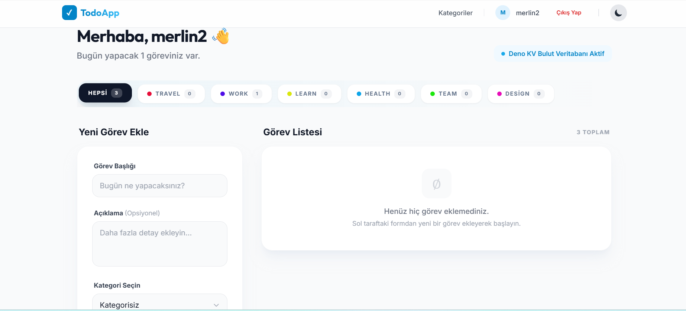
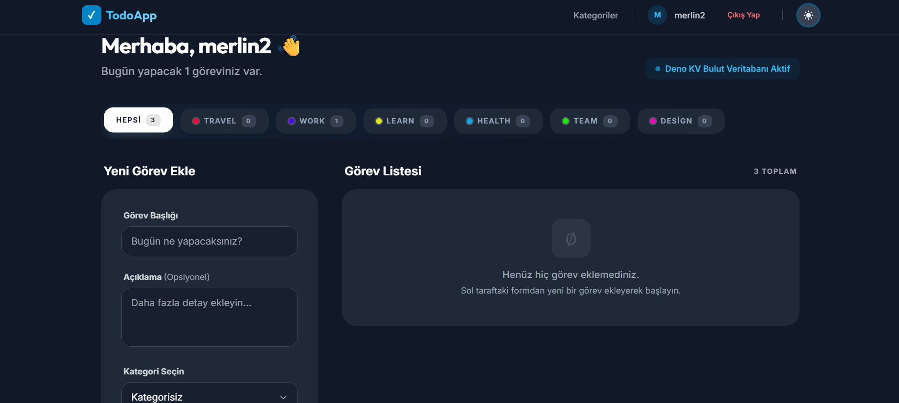
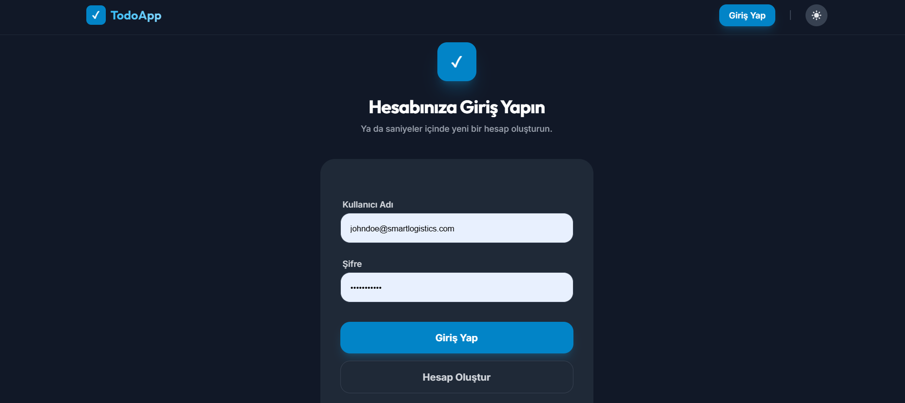
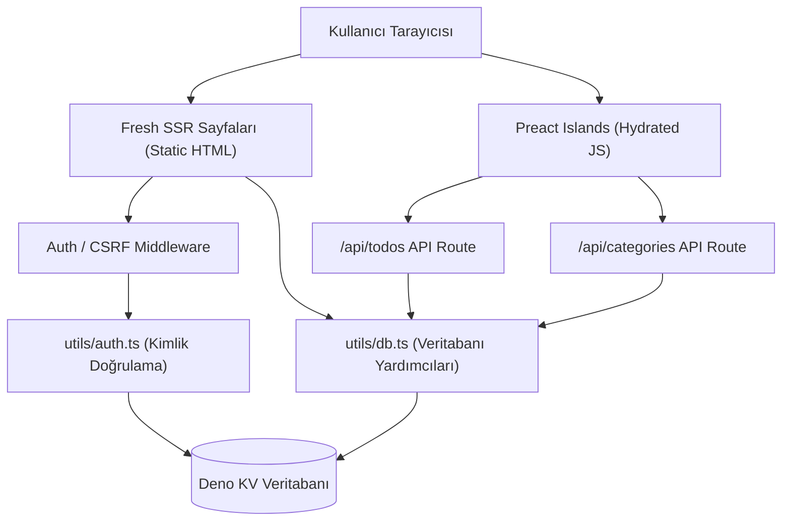

## **Öğrenci AD: MERLIN DELOR AKENMOE KAMCHE**
## **Öğrenci No: 24080410153**

# Deno Fresh Framework

> **Deno + Fresh ile islands architecture todo app — Preact, Deno KV, edge deploy**


## 🎯 Özet

Bu proje, bireysel kullanıcıların günlük işlerini, kişisel hedeflerini ve akademik planlarını tek bir merkezden organize edebilmeleri amacıyla geliştirilmiş, yüksek performanslı ve modern bir görev yönetimi (Todo) uygulamasıdır. Klasik görev takip araçlarının karmaşık ve yoran yapısı yerine, son derece akıcı, hafif ve kullanıcı odaklı bir arayüz sunar.

Fresh framework'ün yenilikçi sunucu tarafı derleme (SSR) ve adacık mimarisi (Islands Architecture) kullanılarak geliştirilen uygulama, kullanıcılara yüksek hızda sayfa yükleme süreleri sağlarken, istemci tarafına sadece gerekli etkileşimli parçaların JavaScript kodunu gönderir. Çerez tabanlı güvenli oturum yönetimi (Secure Cookies), CSRF koruması, veri sahipliği kontrolleri ve Deno KV yerleşik veritabanı desteği ile hem güvenli hem de sunucusuz (serverless edge deploy) bir deneyim inşa edilmiştir.

## 🎥 Demo

🔗 **Canlı Demo:** [https://final-projesi.delor237.deno.net](https://final-projesi.delor237.deno.net)  
👤 **Demo Hesap:** `demo@example.com` · `demo123`

### Ekran Görüntüleri

| Ana Ekran | Kategori Yönetimi | Dark Mode | Giriş Ekranı |
|:---:|:---:|:---:|:---:|
|  |  |  |  |

## ✨ Ana Özellikler

- ✅ **Görev Yönetimi (Todo CRUD):** Görev ekleme, silme, tamamlama ve düzenleme işlemleri.
- ✅ **Kategori Yönetimi:** Görevleri gruplandırmak için dinamik kategori ekleme, güncelleme, silme ve renk belirleme özellikleri.
- ✅ **Kategoriye Göre Filtreleme:** Görev listesini kategorilere göre anlık olarak filtreleme.
- ✅ **Deno KV Entegrasyonu:** Kurulum gerektirmeyen, atomik işlemleri destekleyen yerleşik Key-Value veritabanı ile tam kalıcılık.
- ✅ **Adacık Mimarisi (Islands Architecture):** Sıfır istemci-tarafı JavaScript (default zero-JS). Sadece formlar, filtreler ve tema değiştirici gibi etkileşimli bileşenler istemcide hydrate edilir.
- ✅ **Server-Side Rendering (SSR):** Hızlı ilk sayfa yüklemesi ve arama motoru optimizasyonu (SEO).
- ✅ **Oturum Yönetimi:** `httpOnly` secure çerezler ile güvenli kimlik doğrulama, kullanıcı kaydı ve çıkış işlemleri.
- ✅ **Güvenlik & CSRF Koruması:** Double Submit Cookie deseniyle CSRF koruması, API düzeyinde rota bazlı sahiplik kontrolleri ve basit rate limiting.
- ✅ **Dark/Light Tema:** Preact Signals ile kontrol edilen ve CSS değişkenleri üzerinde çalışan pürüzsüz tema seçici.
- ✅ **Deno Deploy Uyumlu:** Edge deployment yapısına hazır mimari.

## 🧰 Tech Stack

- **Runtime:** `Deno 2.x` (Secure-by-default, native TypeScript desteği)
- **Web Framework:** `Fresh 1.7.3` (SSR & Islands Architecture)
- **UI Engine:** `Preact 10.x` (React alternatifi, ultra hafif 3KB kütüphane)
- **Reaktivite:** `Preact Signals` (Hızlı ve lokalize state yönetimi)
- **Veritabanı:** `Deno KV` (Dağıtık ve yerleşik Key-Value veritabanı)
- **Stil / Tasarım:** `Twind` (Tailwind CSS 3 uyumlu CSS-in-JS kütüphanesi)
- **Test:** `Deno Test` (Birim testler) & `Playwright` (Uçtan uca E2E testleri)
- **Deployment:** `Deno Deploy` (34 global bölgede çalışan edge altyapısı)

> Teknoloji seçimlerinin detaylı gerekçesi için [PROJE-RAPORU.md · Bölüm 7](PROJE-RAPORU.md#7-teknoloji-yığını-tech-stack) belgesini inceleyebilirsiniz.

## 🏗 Mimari

### Adacık Mimarisi (Islands Architecture)
Uygulama sunucu tarafında tamamen statik HTML olarak derlenir. İstemci tarafında çalışan JavaScript kodları sadece etkileşimli bileşenler (`TodoForm`, `CategoryManager`, `ThemeToggle`) için yüklenir ve hydrate edilir.

### C4 Container Diyagramı



[Detaylı mimari açıklamalar ve ADR'lar için tıklayın →](PROJE-RAPORU.md#8-sistem-mimarisi)

### 🗄️ Deno KV Şeması ve Anahtar Yapısı

Veriler Deno KV üzerinde hiyerarşik anahtar dizileri olarak tutulur:

| Veri Tipi | Anahtar Yapısı (Key Path) | Değer Tipi (Value Type) |
| :--- | :--- | :--- |
| **Kullanıcı** | `["users", userId]` | `User` nesnesi |
| **Kullanıcı Adı İndeksi** | `["users_by_username", username]` | `userId` (string) |
| **Oturum (Session)** | `["sessions", sessionId]` | `userId` (string, 7 günlük TTL ile) |
| **Görev (Todo)** | `["todos", todoId]` | `Todo` nesnesi |
| **Kullanıcı Görev İndeksi** | `["todos_by_user", userId, todoId]` | `Todo` nesnesi |
| **Kategori** | `["categories", userId, categoryId]` | `Category` nesnesi |

## 🚀 Kurulum ve Yerel Çalıştırma

### Gereksinimler

- Deno ≥ 2.0 veya 1.x (En son Deno sürümü önerilir)

### Adım Adım Çalıştırma

1. **Depoyu Klonlayın:**
   ```bash
   git clone https://github.com/delor237/Final-projesi.git
   cd Final-projesi
   ```

2. **Çevre Değişkenlerini Ayarlayın:**
   `.env.example` dosyasını `.env` olarak kopyalayın ve gerekli alanları düzenleyin:
   ```bash
   cp .env.example .env
   ```
   Varsayılan `.env` içeriği:
   ```env
   DENO_KV_PATH=./kv.db
   SESSION_SECRET=your_secret_key_here
   PORT=8000
   FRESH_NO_UPDATE_CHECK=true
   ADMIN_USERNAME=demo_admin
   ADMIN_PASSWORD=change_me_before_running
   ```

3. **Uygulamayı Çalıştırın:**
   ```bash
   deno task start
   ```
   Uygulama yerel ortamda **http://localhost:8000** adresinde çalışmaya başlayacaktır.

## 🧪 Test ve Kalite Komutları

### Deno Görevleri (Yerel Kalite Kontrolleri)

```bash
deno task test                 # Birim (Unit) testleri çalıştırır
deno task check                # TypeScript tip kontrolünü yapar
deno task lint                 # Kod standartları ve kurallarını (Linter) denetler
deno task fmt                  # Kod biçimlendirmesini otomatik düzeltir
deno task build                # Production build çıktısı üretir
deno task preview              # Üretim paketini yerelde test etmek için önizleme başlatır
deno task ci                   # CI/CD testlerinin tamamını tek komutla çalıştırır
```

### Uçtan Uca (E2E) Testleri (Playwright)

Projede tarayıcı davranışlarını simüle eden Playwright testleri mevcuttur. Çalıştırmak için:

```bash
# Node bağımlılıklarını ve Playwright tarayıcılarını yükleyin
npm install
npx playwright install --with-deps

# Başka bir terminal penceresinde uygulamayı önizleme modunda açın
deno task preview

# E2E testlerini koşun
npm run test:e2e
```

CI adımları GitHub Actions üzerinde `.github/workflows/ci.yml` iş akışı aracılığıyla her push işleminde bu testleri koşturmaktadır.

## 📁 Proje Yapısı

```text
.
├── routes/              # Fresh sayfaları ve API uç noktaları (File-based Routing)
├── islands/             # İstemci taraflı etkileşimli Preact bileşenleri (Adacıklar)
├── utils/               # Auth, CSRF koruması, veri doğrulama ve Deno KV yardımcıları
├── docs/                # API dokümantasyonu, veritabanı şeması, mimari ve ADR belgeleri
├── screenshots/         # Proje ekran görüntüleri
├── tests/               # Deno birim testleri
├── e2e/                 # Playwright uçtan uca (E2E) test senaryoları
├── openapi.yaml         # Scalar/Swagger uyumlu OpenAPI 3.1 API sözleşmesi
├── PROJE-RAPORU.md      # Ayrıntılı proje final raporu (Markdown)
├── PROJE-SABLON.md      # Özet proje teslim raporu (Markdown)
├── deno.json            # Deno görevleri (task) ve bağımlılık tanımları
└── package.json         # E2E testleri ve Playwright paketleri
```

## 📖 Dokümantasyon

Uygulamanın teknik detaylarına ve proje süreçlerine ait belgelere aşağıdaki linklerden ulaşabilirsiniz:

- 📄 **Proje Raporu:** [PROJE-RAPORU.md](PROJE-RAPORU.md) (Detaylı Tasarım ve Gerekçeler)
- 📐 **Sistem Mimarisi:** [docs/architecture.md](docs/architecture.md) (Veri Akış ve Yapı Diyagramları)
- 🔌 **API Referansı:** [docs/api-endpoints.md](docs/api-endpoints.md) (Uç Noktalar ve Güvenlik Parametreleri)
- 🗄️ **KV Veritabanı Şeması:** [docs/kv-database-schema.md](docs/kv-database-schema.md) (Deno KV Anahtar Tasarımı)
- 🛡️ **Mimari Tasarım Kararları (ADR):** [docs/adr/](docs/adr/) (Architectural Decision Records)
- 📋 **Ekran Görüntüsü Kontrol Listesi:** [docs/screenshots-checklist.md](docs/screenshots-checklist.md)

## 🛣 Yol Haritası (Roadmap)

- [x] **V1 (Mevcut Teslim)** — Görev CRUD + Deno KV Kalıcılık + Kategori Yönetimi ve Filtreleme + Oturum Yönetimi ve Güvenlik (CSRF/Rate Limit)
- [ ] **V2 (Gelecek Sürüm)** — Çoklu kullanıcı takımları, gerçek zamanlı senkronizasyon (Deno KV Watch API) ve paylaşım özellikleri.
- [ ] **V3 (Mobil Uyum)** — Offline-first PWA veya Deno Native mobil uygulaması.

## 🤝 Katkı

Bu proje **BMU1208 Web Tabanlı Programlama** dersi kapsamında **Bitlis Eren Üniversitesi** — **Bilgisayar Mühendisliği** bölümünde bir final ödevi olarak geliştirilmiştir.

Ders yürütücüsü: **Dr. Öğr. Üyesi Davut ARI**

Kod katkısı beklenmez, ancak fikir / feedback için issue açabilirsiniz.

## 📜 Lisans

MIT © 2026 **MERLIN DELOR AKENMOE KAMCHE** — Tam metin için [LICENSE](LICENSE).

## 🙋‍♂️ İletişim

- **Öğrenci:** MERLIN DELOR AKENMOE KAMCHE
- **Öğrenci No:** 24080410153
- **E-posta:** [delorakenmoe@gmail.com](mailto:delorakenmoe@gmail.com)
- **Ders:** BMU1208 · Web Tabanlı Programlama
- **Kurum:** Bitlis Eren Üniversitesi — Mühendislik-Mimarlık Fakültesi

> **Not:** Bu proje, öğrencinin süresi içinde seçim yapmaması sebebiyle öğretim üyesi tarafından atanmıştır (seçilemeyen projelerden, orta-zor seviyede).

---

<sub>🤖 Bu projede [Claude Code](https://claude.com/claude-code) ve [Cursor](https://cursor.sh) gibi AI asistanları kullanılmıştır. Tüm mimari kararlar ve kullanım tercihleri öğrenci tarafından yapılmıştır.</sub>
