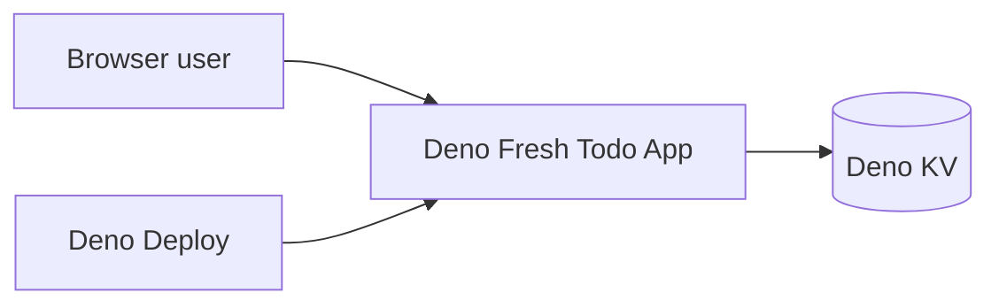
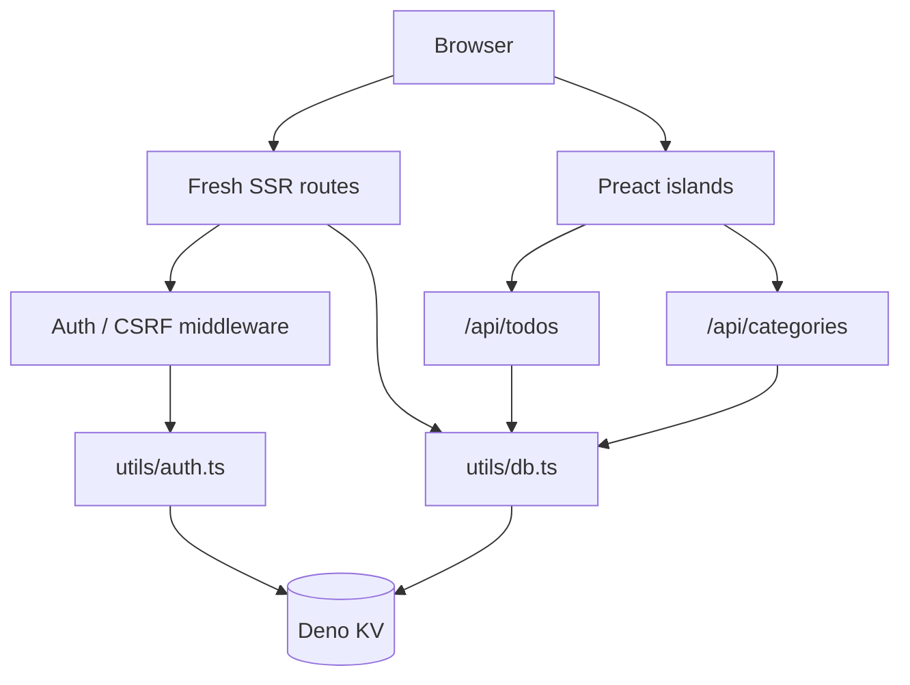
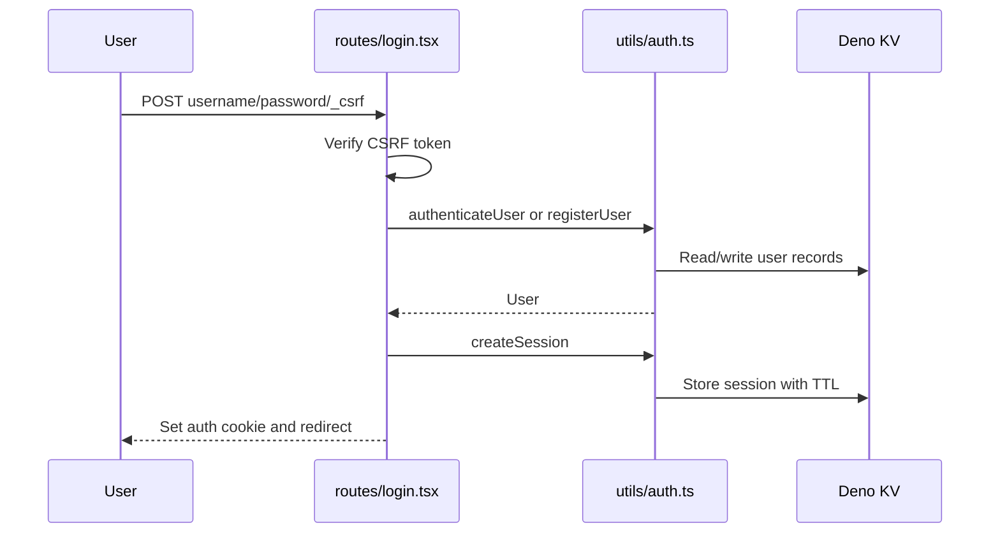
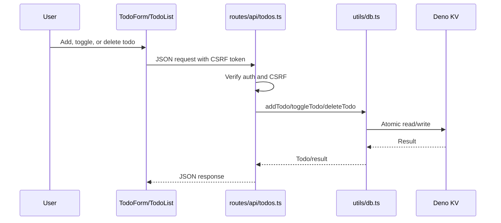
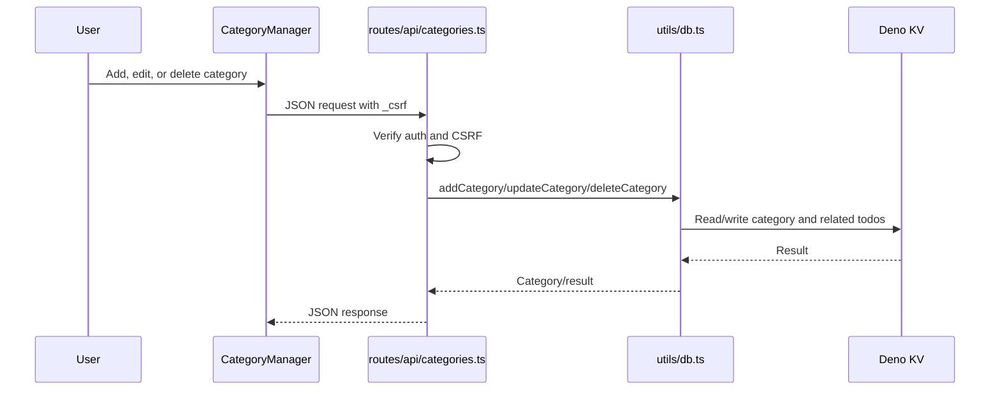
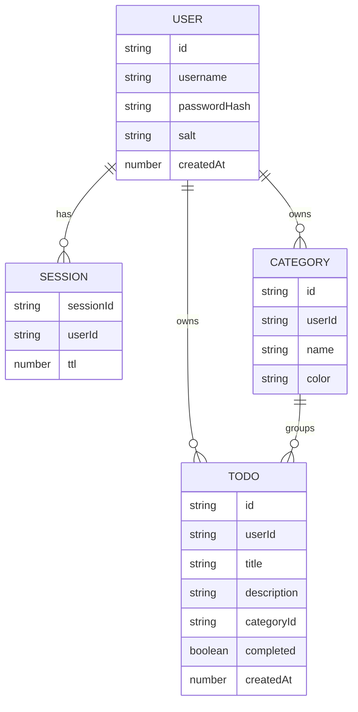
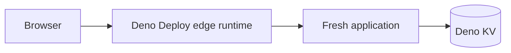

# Architecture

This document records the current architecture of the Deno Fresh Todo
application.

## Context

## Containers

## Login Flow

## Todo Flow

## Category Flow

## Data Model

## Deployment Topology

